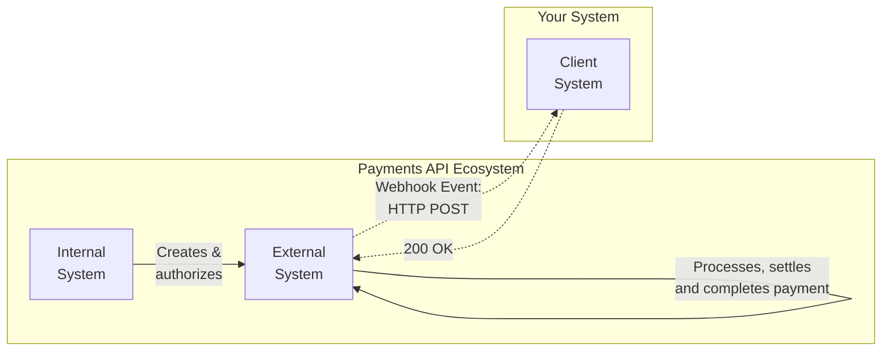

# Why Webhooks Are Delivered at Least Once

## Overview

The Payments API is a system that coordinates and monitors payments between client systems and external financial systems, without direct control over their behavior.

Payments usually go through the following stages: creation, authorization, processing, settlement, and completion. While the internal system handles the creation and authorization, the external system handles the processing, settlement, and completion.

There is a time delay between the initial and final payment stages. Due to this asynchronous nature of the payment process, client systems cannot immediately know the final payment status, so they cannot rely on polling. Polling can be unreliable, out of sync, and a waste of resources. That's why the Payments API uses webhooks to inform client systems that an event (e.g., successful payment completion, cancellation, or failure) happened.

## Webhook Delivery

Webhooks are delivered via HTTP POST after a payment event happens, so delivery is not real-time. The delivery depends on the network and systems outside our control. To account for network latency, server downtime, or other connection issues, the Payments API uses at-least-once delivery. If your server does not send a `200 OK` response within 5 seconds, the API will retry delivery. We use exponential backoff for retries (e.g., at 1, 2, 4, 8-minute intervals).

As a result of at-least-once delivery, your endpoint may occasionally receive the same event more than once. This happens if our system does not get a response, even though you processed the event successfully. That is why you must implement idempotent processing on your side to safely handle potential duplicate events.
