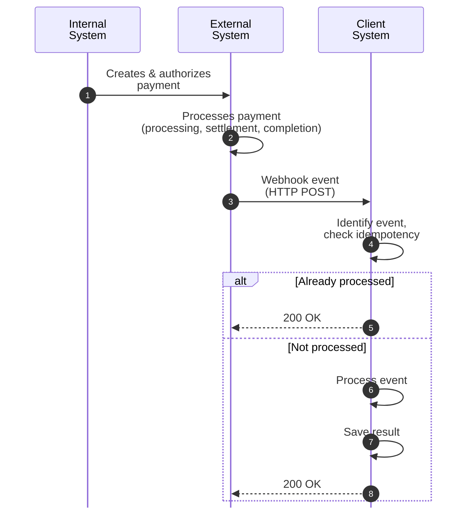

# How to Handle Webhook Deliveries

## Purpose

This guide explains how to handle webhook deliveries, avoid duplicate processing and return a correct response.

## Prerequisites

- Publicly accessible HTTP endpoint.
- Database or cache to store and track event IDs.
- Ability to parse JSON payloads.
- Active API key for signature verification.

## Steps

### Step 1: Verify the request signature

When your endpoint receives an HTTP POST request, verify the `X-Webhook-Signature` header using your secret key and HMAC SHA256. If it is invalid, reject it with a `401 Unauthorized` status code.

**Header example:**

```HTTP
X-Webhook-Signature: t=1770201201,v1=5b7f1e948c2d3a6b5e0f9a2c4d8e7b1a6c5f0e9d8b7a6c5d4e3f2b1a0d9c8b7a
```

### Step 2: Parse the event payload

Extract the JSON body from the request. The `eventId` identifies the event, while the `eventType` determines further action.

**Payload example:**

```JSON
{
  "eventId": "evt_12345ABC",
  "eventType": "payment.completed",
  "paymentId": "pay_98765XYZ",
  "created": "2023-10-27T10:00:00Z",
  "data": {
    "amount": 5000,
    "currency": "EUR",
    "status": "succeeded"
  }
}
```

### Step 3: Check for duplicate events

Check if `eventId` is already in your database or cache. If it is, ignore it and return a `200 OK` response to stop unnecessary retries. This ensures idempotency.

### Step 4: Handle the event logic

Process the event based on its `eventType` (e.g., `payment.completed`, `payment.cancelled`, `payment.failed`) according to your business logic.

### Step 5: Store the event record

Store the processed `eventId` internally. This is required for the idempotency check in Step 3.

### Step 6: Return a response

Send a `200 OK` HTTP response. Make sure your server responds within 5 seconds to prevent the Payments API from triggering a retry.

## Delivery flow overview


